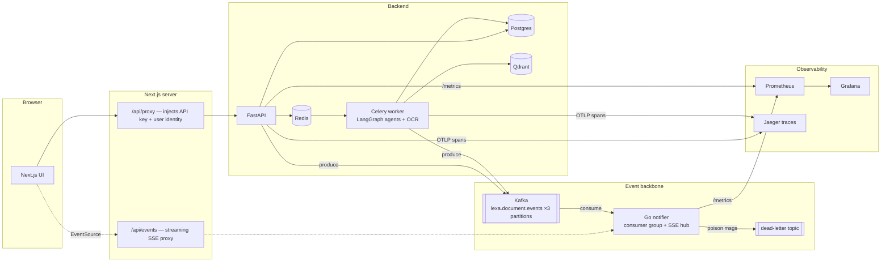

# Lexa — Legal Document Intelligence

Lexa is a distributed, event-driven web application that reads legal documents (PDF, DOCX, TXT — including scanned PDFs via OCR) and returns:

- **AI summaries** — executive overview of any contract or agreement
- **Red-flag detection** — unfair clauses and risk indicators, graded by severity
- **Case-law grounding** — relevant Indian case law via the Indian Kanoon API
- **RAG chat** — natural-language Q&A over the document
- **Real-time status** — document lifecycle streamed to the browser over Kafka → SSE (no polling)

---

## Architecture



**Event flow** — every document emits an ordered stream (keyed by `document_id`, so one document's events always share a partition):

`document.uploaded → document.processing.started → document.processing.completed | document.processing.failed`

The API and worker are pure producers; they don't know who consumes. The Go notifier joins a consumer group (3 replicas split 3 partitions in k8s), fans events out to the right user's browser over SSE, and routes malformed messages to a dead-letter topic instead of wedging. If Kafka or the notifier is down, the frontend silently degrades to slow polling — the app never breaks.

### Tech stack

| Layer | Tech |
| --- | --- |
| Frontend | Next.js 16 (App Router), TypeScript, Tailwind v4, NextAuth (Google OAuth) |
| API | FastAPI, SlowAPI rate limiting, SQLAlchemy |
| AI pipeline | LangGraph agent graph (classify → analyze → risk scan), Google Gemini, Qdrant RAG |
| Async jobs | Celery + Redis, `acks_late` for crash-safe processing |
| Event streaming | Apache Kafka (KRaft), partitioned topic + DLQ, idempotent producer |
| Real-time push | Go microservice: Kafka consumer group → Server-Sent Events |
| Observability | Prometheus + Grafana (provisioned dashboard), OpenTelemetry → Jaeger |
| Deployment | Docker Compose (dev), Kubernetes manifests with HPA + probes (see [k8s/](k8s/)) |

---

## Getting started

### Prerequisites

- Docker Desktop
- Python 3.11+ and Node 18+ (for host-run dev)
- Optional: Tesseract OCR + Poppler in PATH (scanned-PDF fallback)

### 1. Environment

```bash
cp .env.example .env                              # root — backend + compose
cp frontend/.env.local.example frontend/.env.local # frontend
# fill in: passwords, GEMINI_API_KEY, Google OAuth creds, shared LEXA_SECRET_API_KEY
```

### 2. Infrastructure (one command)

```bash
docker compose up -d --build
```

That starts Postgres, Redis, Qdrant, **Kafka** (+ topic bootstrap), the **Go notifier**, **Jaeger**, **Prometheus**, and **Grafana** — everything except the Python/Node apps, which you run on the host for fast iteration.

### 3. Backend + worker (host)

```bash
cd backend
python -m venv venv && venv\Scripts\activate   # macOS/Linux: source venv/bin/activate
pip install -r requirements.txt

uvicorn app.main:app --reload                  # terminal 1 — API
celery -A celery_app worker --loglevel=info --pool=solo   # terminal 2 — worker (Windows needs --pool=solo)
```

### 4. Frontend (host)

```bash
cd frontend
npm install
npm run dev
```

Open [http://localhost:3000](http://localhost:3000). Upload a contract and watch its status flip live — that's Kafka → Go → SSE, not polling (the sidebar badge shows `LIVE` vs `POLL`).

### Fully containerized (production-like)

```bash
docker compose --profile full up -d --build
```

Runs everything — API, Celery worker, frontend, notifier — as containers.

### Kubernetes

Full manifests with autoscaling, probes, and an SSE-safe ingress live in [k8s/](k8s/) — see [k8s/README.md](k8s/README.md).

---

## Observability tour

| Where | What you'll see |
| --- | --- |
| [localhost:3001](http://localhost:3001) — Grafana (`admin`/`admin`) | Provisioned **Lexa — System Overview**: request rate, p95 latency, Kafka throughput by event type, consumer lag, live SSE clients, DLQ count |
| [localhost:16686](http://localhost:16686) — Jaeger | One trace per upload: FastAPI request → Celery task → SQL queries → outbound HTTP, stitched across processes |
| [localhost:9090](http://localhost:9090) — Prometheus | Raw metrics: `http_requests_total`, `lexa_notifier_*` |
| `localhost:8000/metrics`, `localhost:8090/metrics` | Scrape endpoints (FastAPI, Go notifier) |

Useful Kafka commands:

```bash
# tail the live event stream
docker exec -it lexa-kafka /opt/kafka/bin/kafka-console-consumer.sh \
  --bootstrap-server localhost:9092 --topic lexa.document.events

# inspect consumer-group lag
docker exec -it lexa-kafka /opt/kafka/bin/kafka-consumer-groups.sh \
  --bootstrap-server localhost:9092 --describe --group lexa-notifier
```

---

## Project structure

```
Lexa/
├── backend/
│   ├── app/
│   │   ├── agents/          # LangGraph graph: classify → analyze → risk_finder
│   │   ├── api/             # FastAPI routes (documents, chat)
│   │   ├── core/            # config, db, security, limiter, telemetry (OTel)
│   │   ├── models/          # SQLAlchemy models
│   │   ├── services/        # embeddings, Kanoon client, event_bus (Kafka producer)
│   │   └── workers/         # Celery pipeline (extract → agents → embed)
│   └── Dockerfile           # one image, two roles: api / worker
├── notifier/                # Go: Kafka consumer group → SSE hub + DLQ + metrics
├── frontend/
│   └── src/
│       ├── app/             # pages + /api/proxy + /api/events (SSE proxy)
│       ├── components/      # design system (Linear-dark)
│       ├── hooks/           # useDocumentEvents — SSE with polling fallback
│       └── lib/             # API client, shared types
├── infra/
│   ├── prometheus/          # scrape config
│   └── grafana/             # provisioned datasource + dashboard
├── k8s/                     # namespace, deployments, HPA, ingress, secrets template
└── docker-compose.yml       # infra profile (default) + full profile
```

---

## Environment variables

| Variable | Where | Description |
| --- | --- | --- |
| `GEMINI_API_KEY` | root `.env` | Google Gemini key |
| `POSTGRES_*`, `REDIS_PASSWORD` | root `.env` | datastore credentials |
| `LEXA_SECRET_API_KEY` | both env files | shared secret; Next.js proxy → FastAPI auth |
| `KAFKA_BOOTSTRAP_SERVERS` | root `.env` | `localhost:9094` host-run, `kafka:9092` in-cluster |
| `KAFKA_ENABLED` / `OTEL_ENABLED` | root `.env` | feature switches — app runs fine with both off |
| `OTEL_EXPORTER_OTLP_ENDPOINT` | root `.env` | OTLP/HTTP collector (Jaeger) |
| `KANOON_API_TOKEN` | root `.env` | Indian Kanoon API (optional) |
| `NEXTAUTH_*`, `GOOGLE_CLIENT_*` | `frontend/.env.local` | Google OAuth |
| `NOTIFIER_URL` | `frontend/.env.local` | Go notifier base URL for the SSE proxy |

---

## License

MIT
